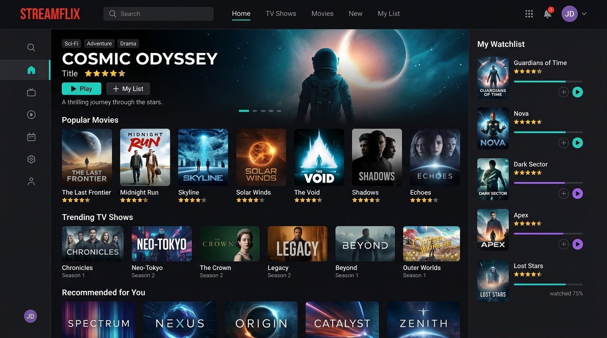

# Film ve Dizi Takip Sistemi (İzleme Günlüğü)

Kullanıcıların izledikleri veya gelecekte izlemek istedikleri film ve dizileri listeleyip puanlayabildikleri, kişisel bir izleme günlüğü (watchlist) uygulamasıdır.

## 🚀 Kullanılan Teknolojiler
* **Mimari:** ASP.NET Core MVC
* **Veri Tabanı / ORM:** Dapper ORM & SQL Server (Hafif ve hızlı veri erişim altyapısı)
* **Tasarım:** HTML, CSS, JavaScript, Bootstrap

## ✨ Özellikler / Yapı
* İzleme listesi (Watchlist) yönetimi.
* İzlenen yapımlara özel puanlama, inceleme ve yorum ekleme.
* Dapper ORM kullanımı sayesinde hızlı veritabanı sorguları.

## 🛠️ Nasıl Çalıştırılır?
1. SQL Server üzerinde gerekli tabloları oluşturun.
2. `appsettings.json` içindeki SQL bağlantı dizesini yerel sunucunuza göre düzenleyin.
3. Visual Studio'da projeyi çalıştırın.
